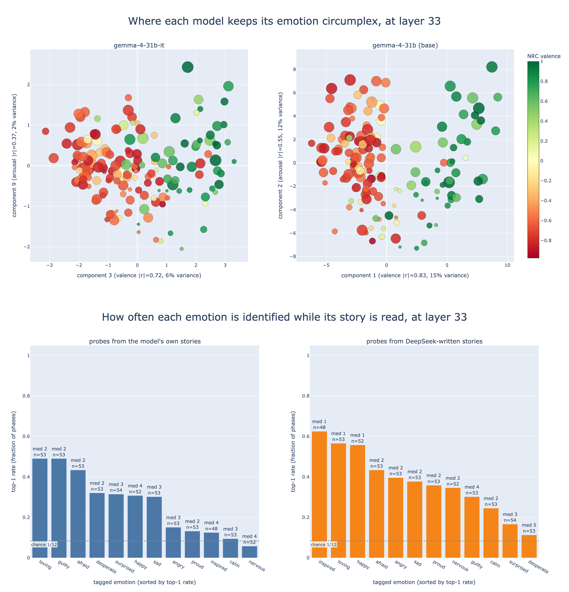

# Emotion vectors in Gemma 4 31B

**Replicating Anthropic's emotion-vectors result on an open model, and asking what happens when the emotion changes partway through a story**

<p align="center">
  
</p>

<p align="center"><em><b>(Top) The geometry.</b> Each dot is one emotion, placed by the principal components of 171 emotion vectors and coloured by its published human valence rating. Neither the axes nor the positions ever see a human rating. On the right, the base model's largest component is valence: the colours sort themselves left to right at an absolute correlation of 0.83, and the second component is arousal. That is the circumplex, recovered unprompted. On the left, after instruction tuning, the same structure survives but is demoted. It appears at components 3 and 9 and correlates at 0.72. A different and larger component takes first place, and we could not identify it.<br><br><b>(Bottom) Tracking an emotion as a story moves through it,</b> at the same layer. Each bar is one emotion, and its height is how often that emotion's own vector ranks first out of twelve across the story phases written to express it. The dotted line at 1 in 12 is guessing. Nothing reaches half, and the ranking changes with depth. The two panels differ only in who wrote the stories the vectors were built from: the model's own writing on the left, a stronger external writer on the right.</em></p>

## Overview

An **emotion vector** is the average internal state a language model enters while reading stories written to evoke one emotion. Anthropic reported that a model keeps a separate direction for each emotion. Those directions arrange themselves the way psychologists arrange emotions, on a circumplex. Its axes are valence (how pleasant the emotion is) and arousal (how worked-up it is). They released no code.

This repository rebuilds that result on [Gemma 4 31B](https://huggingface.co/google/gemma-4-31b), in both its base and instruction-tuned form, and then asks two questions the paper did not. Three findings:

- **The base model reproduces the published result.** Sort 171 emotion vectors by what separates them most and the largest axis is valence, correlating with human ratings at 0.83. Nothing in that calculation sees a human rating. The claim went through a falsification pass and survived.
- **Instruction tuning demotes it.** Valence falls from first place to third, still present at 0.72. A new largest axis takes over. It carries 28% of the variance against 15% for the base model's top axis, and correlates at most 0.14 with any of the base model's top five. It is not valence, arousal, dominance or story length, and we checked all four.
- **Who writes the stories decides whether any of this works.** Nobody reports which model generated the corpus a set of emotion vectors is built from. Holding everything else fixed, story source moves the number of usable layers from 1 to 9 out of 20.

Read the [full write-up here](https://antonio-tresol.github.io/gemma4-emotion-vectors/). Every figure in it states what a failure would have looked like beside what was observed.

Replicating: Sofroniew et al., [*Emotion Concepts and their Function in a Large Language Model*](https://transformer-circuits.pub/2026/emotions/index.html), Anthropic, 2026.

Every corpus, vector set and per-token activation is published on [Hugging Face](https://huggingface.co/abotresol), public and needing no account. The story corpora are browsable in one place: [`abotresol/emotion-story-corpora`](https://huggingface.co/datasets/abotresol/emotion-story-corpora).

This was a three-day sprint, not a paper. It has had no external review, and the null and failed results are included and labelled as such.

## Installation

```bash
git clone https://github.com/Antonio-Tresol/gemma4-emotion-vectors.git
cd gemma4-emotion-vectors

uv sync
```

That is enough for the analysis and every figure. Only generating stories and extracting activations needs a GPU:

```bash
uv sync --extra gpu
```

## How an emotion vector is built

For one emotion, take the stories written to evoke it, run each through the model, and average the residual stream over the story's tokens. Then subtract the average over all emotions:

```
vector(e) = mean(activations for emotion e) - mean(activations over every emotion)
```

That subtraction is what makes the vector specific. Without it every emotion vector points mostly at "this is emotional writing", and they all look alike.

Two details decide whether the result means anything:

- **The first 50 tokens of each story are skipped.** They carry the prompt's framing rather than the story's emotion.
- **Scoring uses a centered cosine, not a raw dot product.** The token-weighted mean over the whole story set is subtracted first. Skip that and a vector that is simply large everywhere wins by default.

## Quick start

### Load a set of emotion vectors

```python
import numpy as np
from emotion_vectors.artifacts import fetch

bundle = np.load(fetch("emotion_vectors_it_postfix/emotion_means.npz"), allow_pickle=True)
print(bundle["means"].shape)  # (171, 20, 5376) = emotions x layers x model width
print(list(bundle["layers"]))  # [0, 3, 6, ... 57], every third layer
print(bundle["emotions"][:4])  # ['afraid' 'alarmed' 'alert' 'amazed']
```

`fetch()` looks in the local `results/` tree first and downloads from Hugging Face otherwise, so a notebook runs unchanged on a fresh clone. No account or token is needed.

### Score a story token by token

```python
import numpy as np
from emotion_vectors.artifacts import fetch
from emotion_vectors.q3_conventions import centered_cos, manifest_rows, story_set_mean

trajectories = fetch("combined_trajectories_deepseek_constant")
rows, orphans = manifest_rows(trajectories)
mean_dots = story_set_mean(trajectories, rows)  # the story-set mean, per layer

shard = np.load(trajectories / "shards" / f"{rows[0]['story_id']}.npz")
scores = centered_cos(shard, mean_dots)  # (tokens, layers, emotions)
```

### Look at what happens around a written turn

```python
from emotion_vectors.trajectories import transition_windows

layer = 3  # index into bundle["layers"]
before, after = transition_windows(
    scores[:, layer, :3],  # this story's three emotions
    rows[0]["phase_token_starts"],
    window=16,  # tokens either side of the turn
)
```

## Notebooks

The report, numbered in reading order, with an index in [`notebooks/README.md`](notebooks/README.md). Cells import, call and narrate; the analysis and figure code lives in [`src/emotion_vectors/`](https://github.com/Antonio-Tresol/gemma4-emotion-vectors/tree/main/src/emotion_vectors) so it can be tested without a kernel.

| notebook | what it answers |
|---|---|
| [01 corpora and extraction](https://github.com/Antonio-Tresol/gemma4-emotion-vectors/blob/main/notebooks/01_corpora_and_extraction.ipynb) | what the stories are, and how activations become vectors |
| [02 circumplex geometry](https://github.com/Antonio-Tresol/gemma4-emotion-vectors/blob/main/notebooks/02_circumplex_geometry.ipynb) | does the circumplex appear, and does it match human ratings |
| [03 detection probes](https://github.com/Antonio-Tresol/gemma4-emotion-vectors/blob/main/notebooks/03_detection_probe_campaign.ipynb) | do the vectors identify the emotion of a held-out scenario |
| [04 paper plot parity](https://github.com/Antonio-Tresol/gemma4-emotion-vectors/blob/main/notebooks/04_paper_plot_parity.ipynb) | do our figures match the ones we are replicating |
| [05 trajectories, instruct](https://github.com/Antonio-Tresol/gemma4-emotion-vectors/blob/main/notebooks/05_trajectory_explorer_instruct.ipynb) | one story, token by token, in the instruction-tuned model |
| [06 trajectories, base](https://github.com/Antonio-Tresol/gemma4-emotion-vectors/blob/main/notebooks/06_trajectory_explorer_base.ipynb) | the same story in the base model |
| [07 story sources](https://github.com/Antonio-Tresol/gemma4-emotion-vectors/blob/main/notebooks/07_generator_lineages.ipynb) | does who wrote the stories change the vectors |
| [08 transition first reads](https://github.com/Antonio-Tresol/gemma4-emotion-vectors/blob/main/notebooks/08_transition_tracking_first_reads.ipynb) | does the model track an emotion that changes |
| [09 trajectories, DeepSeek](https://github.com/Antonio-Tresol/gemma4-emotion-vectors/blob/main/notebooks/09_trajectory_explorer_deepseek.ipynb) | the same, on stories written by a stronger model |
| [10 the sprint story](https://github.com/Antonio-Tresol/gemma4-emotion-vectors/blob/main/notebooks/10_the_sprint_story.ipynb) | the whole project, start to finish |
| [11 tracking taxonomy](https://github.com/Antonio-Tresol/gemma4-emotion-vectors/blob/main/notebooks/11_tracking_taxonomy.ipynb) | which emotions are tracked, and where they are confused |

Every figure carries the scale it should be judged on: a chance line, a noise floor, and the pass mark fixed before scoring.

## Reproducing from scratch

Generating stories and extracting activations needs a GPU. Everything after that runs on a laptop from the published data.

1. **Generate** the story corpora ([`generate_openrouter_stories.py`](https://github.com/Antonio-Tresol/gemma4-emotion-vectors/blob/main/scripts/generate_openrouter_stories.py), [`combined_story_gen/`](https://github.com/Antonio-Tresol/gemma4-emotion-vectors/tree/main/scripts/combined_story_gen))
2. **Extract** per-story activations ([`extract_emotion_vectors.py`](https://github.com/Antonio-Tresol/gemma4-emotion-vectors/blob/main/scripts/extract_emotion_vectors.py), GPU)
3. **Score** the detection sweep and the emotion-tracking reads ([`scripts/score_*.py`](https://github.com/Antonio-Tresol/gemma4-emotion-vectors/tree/main/scripts))
4. **Falsify** each claim against permutation nulls and random-direction controls ([`scripts/falsify_*.py`](https://github.com/Antonio-Tresol/gemma4-emotion-vectors/tree/main/scripts))
5. **Validate** that every claim still resolves to a file that exists ([`validate_research.py`](https://github.com/Antonio-Tresol/gemma4-emotion-vectors/blob/main/scripts/validate_research.py))

Each script carries its own runnable command in its docstring. `./check.sh` runs the formatter, the linter, the tests, and a gate that fails if any claim in [`TREE.md`](https://github.com/Antonio-Tresol/gemma4-emotion-vectors/blob/main/TREE.md) cites a file that does not exist; [`RESEARCH_LOG.md`](https://github.com/Antonio-Tresol/gemma4-emotion-vectors/blob/main/RESEARCH_LOG.md) is the daily record, dead ends included. That scaffolding is not specific to emotion vectors, and the reusable part of it is [research-engineering-harness](https://github.com/Antonio-Tresol/research-engineering-harness).

## Data

| dataset | what it holds |
|---|---|
| [`emotion-story-corpora`](https://huggingface.co/datasets/abotresol/emotion-story-corpora) | every story corpus, two browsable subsets, filterable by `source` |
| [`emotion-vectors-gemma-4-31b-postfix`](https://huggingface.co/datasets/abotresol/emotion-vectors-gemma-4-31b-postfix) | base-model emotion vectors, 171 emotions x 20 layers |
| [`emotion-vectors-gemma-4-31b-it-postfix`](https://huggingface.co/datasets/abotresol/emotion-vectors-gemma-4-31b-it-postfix) | the same for the instruction-tuned model |
| [`emotion-combined-trajectories-gemma-4-31b-it-v2`](https://huggingface.co/datasets/abotresol/emotion-combined-trajectories-gemma-4-31b-it-v2) | per-token activations over three-emotion stories |
| [`emotion-vectors-experiment-artifacts`](https://huggingface.co/datasets/abotresol/emotion-vectors-experiment-artifacts) | every scored output and falsification scorecard the notebooks cite |

[`DATA.md`](DATA.md) is the full index. The `-postfix` sets supersede their unsuffixed predecessors, which were extracted before a padding bug was found; each carries a [`LINEAGE.md`](https://huggingface.co/datasets/abotresol/emotion-vectors-gemma-4-31b-it-postfix/blob/main/LINEAGE.md) recording what changed and by how much.

Worth knowing the size of that bug before building on any of this. A left-padding default had 4,032 A/B logits read mid-prompt, which turned two real effects into false nulls. The vectors before and after the fix agree to a cosine of 0.9999, while the contrast directions built from them fall to 0.62 on the instruction-tuned model. A change too small to see in the activations can still invert what you conclude from them.

## Citation

[`CITATION.cff`](https://github.com/Antonio-Tresol/gemma4-emotion-vectors/blob/main/CITATION.cff) carries the machine-readable citation, including a reference to the work being replicated.

## Licence

MIT, for the code and the write-up here. The model weights, the [NRC VAD lexicon](http://saifmohammad.com/WebPages/nrc-vad.html) and the external corpora carry their own licences.

## Feedback

Corrections are welcome, particularly on claims that outrun their evidence. [Open an issue](https://github.com/Antonio-Tresol/gemma4-emotion-vectors/issues).
